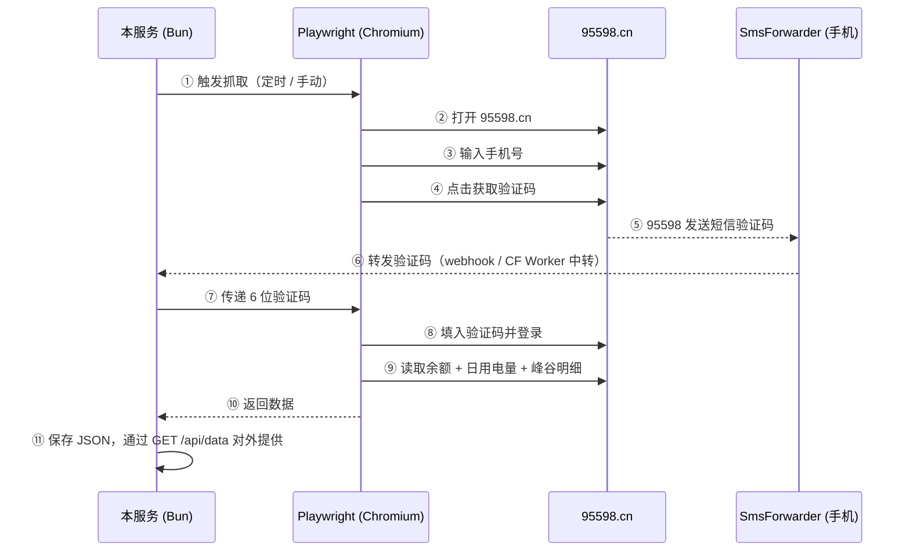
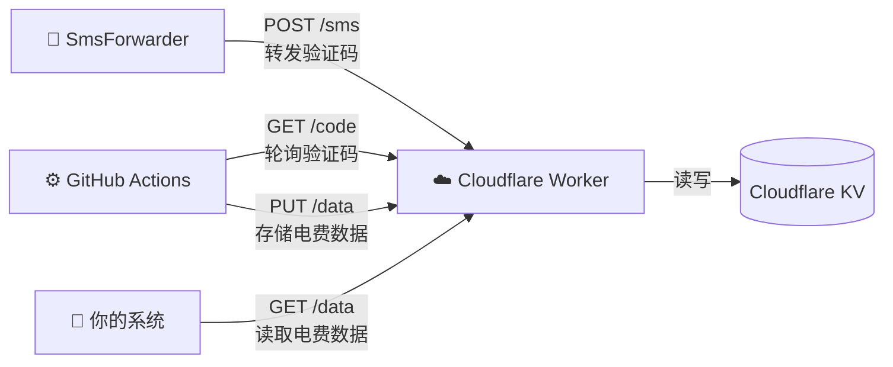

# sgcc-electricity-scraper

自动抓取[国家电网 95598](https://95598.cn) 的**电费余额**与**每日用电量**数据，以 HTTP API 形式对外提供。

> 适用于国家电网（State Grid）覆盖区域的居民用户，南方电网用户不适用。

## 它是怎么工作的

国家电网没有开放的数据 API，本项目通过浏览器自动化模拟真人操作来获取数据。整个流程完全自动，无需人工干预：



**关键设计**：登录 95598 需要短信验证码，本服务通过 [SmsForwarder](https://github.com/pppscn/SmsForwarder) 配合手机实现全自动闭环——手机收到验证码短信后自动转发，服务再将验证码填入浏览器完成登录。

---

## 前置条件

无论选择哪种部署方案，都需要：

- 国家电网 95598 账号（已绑定手机号）
- Android 手机安装 [SmsForwarder](https://github.com/pppscn/SmsForwarder)，用于自动转发验证码短信

### 配置 SmsForwarder

在手机上安装 [SmsForwarder](https://github.com/pppscn/SmsForwarder) 后，添加一条转发规则：

1. **转发规则** — 新建规则：
   - 匹配字段：短信内容
   - 匹配模式：包含
   - 匹配值：`95598` 或 `国家电网`
   - 发送通道：选择下面创建的 Webhook 通道

2. **发送通道** — 新建 Webhook 通道（两种方案的配置不同，见下文）：
   - 请求方式：`POST`
   - Content-Type：`application/json`
   - 请求模板：`{"text": "[msg]"}`
   - URL 和 Header：**根据你选择的部署方案填写**（见各方案说明）

---

## 两种部署方案

| | 方案 A：本地部署 | 方案 B：GitHub Actions + Cloudflare |
|---|---|---|
| **运行环境** | 你自己的服务器/NAS（7×24 运行） | GitHub Actions（定时触发，用完即走） |
| **短信验证码** | SmsForwarder → 直接 POST 到服务 webhook | SmsForwarder → Cloudflare Worker 中转 → scraper 轮询 |
| **数据存储** | 本地 JSON 文件，通过 API 对外提供 | 存到 Cloudflare KV，通过 Worker 的 `GET /data` 读取 |
| **适合场景** | 有 24 小时运行的机器 | 没有常开服务器，或只想白嫖 |
| **费用** | 自付服务器电费 | 全免费（GitHub Actions 2000 分钟/月 + CF Worker 免费额度） |

---

## 方案 A：本地部署

### 额外前置条件

- [Bun](https://bun.sh) >= 1.0

### 快速开始

```bash
git clone https://github.com/a1245582339/sgcc-electricity-scraper.git
cd sgcc-electricity-scraper

bun install
bunx playwright install chromium

cp .env.example .env
# 编辑 .env，填入 PHONE_NUMBER 和 API_TOKEN

bun run start
```

启动后访问 http://localhost:9559/health 确认服务正常。

### Docker 部署

```bash
docker build -t sgcc-electricity-scraper .

docker run -d \
  --name sgcc-electricity \
  --restart unless-stopped \
  -p 9559:9559 \
  -v sgcc-electricity-data:/app/data \
  -e PHONE_NUMBER=你的手机号 \
  -e API_TOKEN=your-secret-token \
  -e CRON_SCHEDULE="0 8 * * *" \
  sgcc-electricity-scraper
```

### SmsForwarder 发送通道配置（方案 A）

- URL：`http://<服务地址>:9559/api/webhook/sms`
- Header（如设了 API_TOKEN）：`Authorization: Bearer your-secret-token`

### 环境变量（方案 A）

| 变量 | 必填 | 默认值 | 说明 |
|------|:----:|--------|------|
| `PHONE_NUMBER` | **是** | - | 国网 95598 绑定的手机号 |
| `API_TOKEN` | 否 | 空 | API 访问令牌，未设置则不鉴权 |
| `PORT` | 否 | `9559` | HTTP 服务端口 |
| `CRON_SCHEDULE` | 否 | 空 | 定时抓取 cron 表达式，如 `0 8 * * *` |
| `RUN_ON_START` | 否 | `false` | 启动时立即抓取一次 |

---

## 方案 B：GitHub Actions + Cloudflare Worker

无需自己的服务器。通过 GitHub Actions 定时运行抓取，Cloudflare Worker 做短信验证码中转。

### 架构



抓取完成后数据直接存到 Cloudflare KV 里，通过 `GET /data` 就能读取，不需要另外搞个服务器。

### 步骤 1：Fork 本仓库

1. 点击本仓库右上角的 **Fork** 按钮，Fork 到你的 GitHub 账号下
2. 后续所有操作都在**你 Fork 的仓库**中进行

### 步骤 2：部署 Cloudflare Worker

Worker 代码在 `worker/` 目录，用于中转短信验证码。需要一个 [Cloudflare 账号](https://dash.cloudflare.com/sign-up)（免费）。

**2.1** 克隆仓库并进入 worker 目录：

```bash
git clone https://github.com/<你的用户名>/sgcc-electricity-scraper.git
cd sgcc-electricity-scraper/worker
```

**2.2** 安装 [wrangler](https://developers.cloudflare.com/workers/wrangler/)（Cloudflare 的命令行工具）：

```bash
npm install -g wrangler
```

**2.3** 登录你的 Cloudflare 账号（会自动打开浏览器，点击授权即可）：

```bash
wrangler login
```

**2.4** 创建 KV 存储空间（用于临时保存验证码）：

```bash
wrangler kv namespace create SMS_KV
```

运行后终端会输出类似这样的信息：

```
🌀 Creating namespace with title "sms-relay-SMS_KV"
✨ Success!
Add the following to your configuration file:
{ binding = "SMS_KV", id = "a1b2c3d4e5f67890abcdef1234567890" }
```

**2.5** 复制配置模板并填入你的 KV id：

```bash
cp wrangler.toml.example wrangler.toml
```

打开刚生成的 `wrangler.toml`，取消 KV 配置的注释并把上一步得到的 `id` 填进去：

```toml
[[kv_namespaces]]
binding = "SMS_KV"
id = "a1b2c3d4e5f67890abcdef1234567890"
```

> `wrangler.toml` 已在 `.gitignore` 中，不会被提交到仓库，你的 KV id 不会泄露。

**2.6** 部署 Worker 到 Cloudflare：

```bash
wrangler deploy
```

部署成功后终端会输出你的 Worker URL，形如：

```
https://sms-relay.<你的子域名>.workers.dev
```

**记下这个 URL**，后续配置 SmsForwarder 和 GitHub Secrets 都要用到。

**2.7** 设置鉴权密钥（防止别人调用你的 Worker）：

先生成一个随机字符串作为密钥：

```bash
openssl rand -hex 16
# 输出类似：e3b0c44298fc1c149afbf4c8996fb924
```

**记下这个字符串**，然后把它设置到 Worker 的环境变量里：

```bash
wrangler secret put API_TOKEN
# 终端会提示 "Enter a secret value:"
# 粘贴上面生成的随机字符串，回车确认
```

这里 `API_TOKEN` 是变量名（固定的，不要改），你粘贴的随机字符串是它的值。这个值就是后面配置 SmsForwarder Header 和 GitHub Secrets 中 `SMS_RELAY_TOKEN` 用的同一个东西。

### 步骤 3：SmsForwarder 发送通道配置（方案 B）

- URL：`https://sms-relay.<你的子域名>.workers.dev/sms`
- Header：`Authorization: Bearer <你在步骤2设置的 API_TOKEN>`

### 步骤 4：配置 GitHub Actions Secrets

在你的仓库中，进入 **Settings → Secrets and variables → Actions → New repository secret**，逐个添加：

| Secret 名称 | 值从哪来 | 示例 |
|-------------|---------|------|
| `PHONE_NUMBER` | 你的国网 95598 绑定手机号 | `13800138000` |
| `SMS_RELAY_URL` | 步骤 2.6 部署完成后终端输出的 Worker URL | `https://sms-relay.xxx.workers.dev` |
| `SMS_RELAY_TOKEN` | 步骤 2.7 你自己生成并设置的那个随机字符串 | `e3b0c44298fc1c149afbf4c8996fb924` |

只需要这 3 个。抓取完成后数据会自动存到 Cloudflare KV 里（通过同一个 Worker），不需要额外配置。

### 步骤 5：验证

1. 在仓库的 **Actions** 页面，点击左侧 `Electricity Scraper`，然后点 **Run workflow** 手动触发一次
2. 查看 Actions 日志，确认抓取成功
3. 浏览器访问 `https://sms-relay.<你的子域名>.workers.dev/data`，确认能看到电费数据

配置完成后，GitHub Actions 会按 cron 定时自动运行（默认北京时间 0:00 和 6:00 各一次），可在 `.github/workflows/scrape.yml` 中修改。

### 读取数据

数据存在 Cloudflare KV 里，通过 Worker 的 `GET /data` 公开接口读取（无需鉴权）：

```bash
curl https://sms-relay.<你的子域名>.workers.dev/data
```

返回格式与方案 A 的 `GET /api/data` 完全相同。如果你有其他服务（如 magic-mirror 的 Go server）需要消费电费数据，把 `ELECTRICITY_API_URL` 指向这个 Worker URL 即可。

---

## API 文档

所有 `/api/*` 路由支持 Bearer Token 鉴权。设置了 `API_TOKEN` 环境变量后，请求需携带：

```
Authorization: Bearer your-secret-token
```

### `GET /api/data`

查询已抓取的用电数据。记录按日期降序排列。

**响应** `200 OK`

```jsonc
{
  "records": [
    {
      "date": "2025-03-13",
      "fetchedAt": "2025-03-14T00:05:12.000Z",
      "balance": "128.56",
      "usage": "12.34",
      "peakUsage": "8.20",
      "valleyUsage": "4.14"
    }
  ],
  "updatedAt": "2025-03-14T00:05:12.000Z"
}
```

| 字段 | 类型 | 说明 |
|------|------|------|
| `records[].date` | `string` | 用电日期 `YYYY-MM-DD` |
| `records[].fetchedAt` | `string` | 抓取时间（ISO 8601） |
| `records[].balance` | `string` | 账户余额（元） |
| `records[].usage` | `string` | 当日总用电量（kWh） |
| `records[].peakUsage` | `string` | 峰时段用电量（kWh） |
| `records[].valleyUsage` | `string` | 谷时段用电量（kWh） |
| `updatedAt` | `string` | 最后一次成功抓取时间 |

### `POST /api/trigger`

手动触发一次抓取（异步执行，立即返回）。

| 状态码 | 响应体 | 说明 |
|--------|--------|------|
| `200` | `{"message": "抓取任务已触发"}` | 任务已开始 |
| `409` | `{"error": "抓取任务正在运行中"}` | 同一时间只能运行一个抓取任务 |

### `POST /api/webhook/sms`

接收 SmsForwarder 推送的短信（方案 A 直接调用此接口；方案 B 通过 CF Worker 中转）。

**请求体**

```json
{"text": "【国家电网】验证码654321，您正在登录..."}
```

| 状态码 | 响应体 | 说明 |
|--------|--------|------|
| `200` | `{"message": "验证码已接收"}` | 成功提取验证码 |
| `400` | `{"message": "未找到6位验证码"}` | 未匹配到 6 位数字 |

### `GET /health`

健康检查（无需鉴权）。

```json
{"status": "ok", "running": false}
```

## 数据存储

```
data/
├── records.json      # 用电记录（按日期去重合并）
└── updated_at.txt    # 最后一次抓取时间
```

Docker 部署时建议挂载 volume：`-v sgcc-electricity-data:/app/data`

## 注意事项

- 95598 网站前端使用 Vue，页面渲染较慢，单次抓取耗时约 1~3 分钟
- 同一时间只允许运行一个抓取任务，重复触发会返回 409
- 验证码有效期约 5 分钟，SmsForwarder 需在时限内完成转发
- 建议抓取频率不超过每天 1~2 次，避免触发风控

## 与 [sgcc_electricity_new](https://github.com/ARC-MX/sgcc_electricity_new) 的区别

本项目与 ARC-MX 的 sgcc_electricity_new 解决的是同一个问题——从国家电网获取用电数据，但在技术选型和设计理念上有较大差异：

| 对比维度 | 本项目 | sgcc_electricity_new |
|---------|--------|---------------------|
| **技术栈** | TypeScript + Bun + Playwright | Python + Selenium + ONNX Runtime |
| **登录方式** | 短信验证码（配合 SmsForwarder 自动转发） | 账号密码 + 滑动验证码（YOLOv3 神经网络离线识别），失败后可回退扫码登录 |
| **数据输出** | HTTP API 对外提供（`GET /api/data`），平台无关 | 直接通过 REST API 推送到 HomeAssistant 传感器实体 |
| **数据存储** | JSON 文件，轻量无依赖 | SQLite / MySQL（可选） |
| **定时调度** | 标准 cron 表达式，灵活可配 | 固定起始时间 + 12 小时间隔 |
| **峰谷电量** | 支持，自动展开并提取峰/谷时段明细 | 不支持 |
| **余额告警** | 不内置，可通过下游消费 API 实现 | 内置 PushPlus / URL 推送 |
| **多用户** | 单账户（单手机号） | 多户号，支持忽略指定用户 ID |
| **HA 集成** | 解耦，不依赖 HomeAssistant | 深度绑定 HomeAssistant |
| **镜像体积** | 较小，无神经网络模型 | ~300MB，包含 ONNX Runtime + YOLOv3 模型 |
| **架构** | 模块化 HTTP 服务（server / scraper / sms / storage / cron） | 单体 Python 脚本 |
| **部署方式** | 本地 Docker 或 GitHub Actions + Cloudflare（零服务器） | Docker（需自托管） |

**简单来说：**

- **sgcc_electricity_new** 是一个为 HomeAssistant 量身定做的方案，开箱即用，通过密码+验证码识别登录，功能全面（多用户、余额告警、数据库存储），但体积较大且与 HA 强耦合。
- **本项目** 是一个轻量级、平台无关的数据服务。通过短信验证码登录避免了验证码识别的复杂性和不稳定性（国网有登录次数限制，验证码识别失败会消耗次数），以标准 HTTP API 输出数据，可以对接任何系统（HA、Grafana、自定义面板等），不局限于 HomeAssistant。代价是需要一台安装了 SmsForwarder 的 Android 手机来转发验证码。

## License

[MIT](LICENSE)
